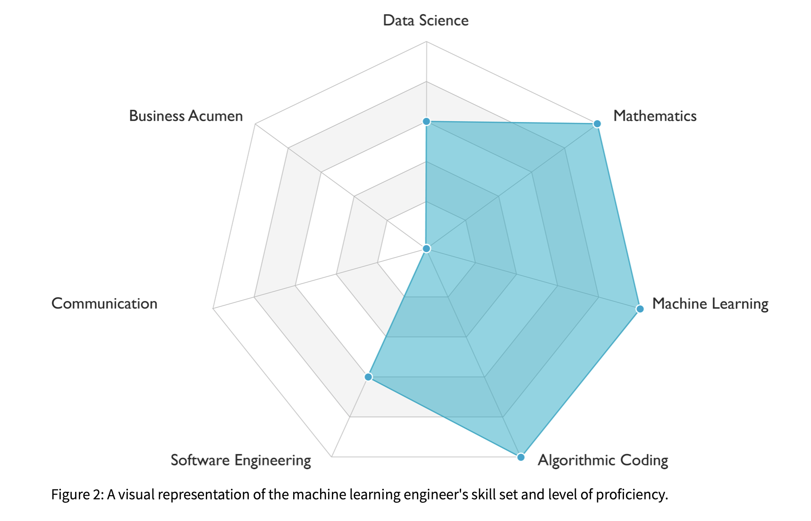

I’m uneasy about the _saviorism_ I see becoming more common in applied machine learning. The concept of “saviorism” dates back at least as far as Rudyard Kipling’s poem [“The White Man’s Burden.”](https://en.wikipedia.org/wiki/The_White_Man%27s_Burden) In this poem, Kipling refers to 19th century imperialist “moral obligations” of white people to encourage people of color’s economic and social progress through colonialism. Some have discussed [tech saviorism](https://www.wired.com/story/tech-needs-to-listen-to-actual-researchers/), a modern-day manifestation of this phenomenon within the Silicon Valley bubble, and this problem has only been exacerbated by the explosive growth of the modern artificial intelligence and machine learning ecosystem. I’ve noticed that many people in the artificial intelligence and machine learning circles act as “AI Saviors,” believing that, when equipped with copious amounts of data and basic knowledge of artificial intelligence techniques, they can quickly solve open problems in unrelated fields.

**Machine learning is a tool to help build solutions, not the entire solution.** Unfortunately, I hear about so many startups, ML[^1]  practitioners, VCs, and researchers that have forgotten the second part. In light of this worrying trend, I want to:

*   Discuss examples of the AI Savior mentality and how this leads to failure. 
*   Speak openly about my own mistaken use of the saviorism attitude to illustrate my points. 
*   Avoid linking to specific current projects or calling out specific individuals for exhibiting AI Saviorism, since my goal is not to put people down -- I want to demonstrate why machine learning practitioners must fight the AI Savior mentality in order to be effective problem-solvers. 
*   Take a stab at rescoping the relationship between ML practitioners and domain experts (as an alternative to AI Saviorism) and invite people to add to or refine it.

## My experience as an AI Savior

In my five years at Stanford, I had plenty of access to high-profile AI thought leaders and researchers. I took several incredible machine learning courses, and there were many AI research opportunities open to me and other undergrads. These courses were incredibly popular—there were close to 1,000 students in one of my machine learning classes! 

As I took more AI courses, I began to buy into the idea that AI methods could be quick solutions to many problems. Only upon reflection do I realize the small things in these courses probably contributed to the AI Saviorism narrative. For instance, an unfortunate consequence of having hundreds of students in these 10-week-long, project-based courses is that the projects tend to be rushed, poorly supervised, and hacked together at the last minute to boast impressive (and sometimes made-up) results for some arbitrary application of machine learning. The project fairs at the end of every class were extremely elaborate and involved lots of outside money: for example, several industry companies sponsored the project fair in my deep learning for NLP class and even [gave out prizes for the “best projects.”](https://web.stanford.edu/class/archive/cs/cs224n/cs224n.1174/reports.html) After these classes, my peers flocked to bootcamps advertised as opportunities to use AI to solve big problems in a variety of fields within the span of one or two quarters. Could AI alone really save the world from health and climate issues in such a short time frame?

By the end of my undergraduate education, I (somewhat misguidedly) strongly believed that [AI methods could be the solution to many problems](https://www.technologyreview.com/2016/01/12/163910/could-ai-solve-the-worlds-biggest-problems/). In my deep learning for genomics class, we read Nature papers about how AI could diagnose illnesses based on x-rays, thus eliminating the need for doctors in the future[^2]. Large tech companies published blog posts describing their efforts to solve daunting medical challenges, climate questions, criminal justice issues, and more[^2]. It felt like every machine learning project went through the beginning stages of a [Gartner hype cycle](https://en.wikipedia.org/wiki/Hype_cycle). I’m ashamed to admit that I bought into the hype, but this issue is much larger than me and warrants greater attention, even if it’s at my expense.

## Losing my AI Saviorism in order to be an effective problem-solver

Reality hit for me when I started working in industry. When recruiting for full-time roles, I checked all the boxes of a technically competent AI Savior -- research experience, strong coding skills, an ability to “think critically” about the technology and acknowledge technical limitations, and a firm belief that non-domain experts could single-handedly revolutionize any industry with AI. The first time we ingested a client’s data, I jumped to coding up baseline models and then convolutional neural networks. Obviously, deep learning would outperform crude heuristics devised by people who couldn’t code, right? Wasn’t that what every applied ML paper boasted?

But my models didn’t work off the bat, and I felt disillusioned. Articles online indicated that I could blame my ML failures on [data issues](https://neoteric.eu/blog/ai-projects-fail-heres-why/) -- maybe there wasn’t enough data, or the data wasn’t clean. In communicating my ML results with the client, I kept giving excuse after excuse -- the data format is inefficient, many rows have missing values, the dataset is only partially labeled, etc. -- for why I, the AI Savior, couldn’t quickly deliver a solution. In hindsight, there are so many other barriers to making ML work in production, and at the time [I thought I was only there to solve the modeling and engineering problems](https://workera.ai/resources/machine-learning-engineer/).

*This figure (figure 2) depicts skills needed for a machine learning engineer, taken from the [deeplearning.ai article](https://workera.ai/resources/machine-learning-engineer/) on what a machine learning engineer does.[^3]*

My frustration only deepened when I realized that our product needed to be a recurring solution, not a one-time solution. I couldn’t save the client with a quick AI patch to all their problems and move on. AI Saviorism was preventing me from being an effective engineer: I needed to stop blaming my failures on lack of data or things “not in my control.” If I were really interested in machine learning to make a positive impact, I needed to figure out what my clients needed, not write more TensorFlow code. 

As I’ve learned this past year, it’s pretty naive to assume my clients will have perfectly cleaned data, lightweight infrastructure, and a clear idea of the correct machine learning metric to evaluate. If they had all these things, I wouldn’t have a job! To be an effective problem-solver, I had to realize:

1. For any machine learning project to be successful, you need buy-in from relevant stakeholders. You need to figure out what they want, work with them to frame those goals in ways such that success can be quantified and measured, and help them understand how the models you produce (hopefully) achieve those objectives.
2. Building machine learning models is only part of the solution, not the entire solution. There are many other technical parts of the machine learning stack: data ingestion, validation, cleaning, training, evaluation, retraining, predicting, serving, and more. You can’t just build a big black AI box and hand it to the stakeholder -- you need to figure out how to connect their data to your black box, and connect your black box outputs to a part of their technology stack that they use regularly.

I now firmly believe that it is on the ML practitioner to work with the stakeholder to embed their tools into the stakeholder’s stack to enable solutions, not magically promise solutions that work out-of-the-box. Over time, my AI Savior complex crumbled as I began to clean the data myself, listen to domain experts on how one would solve the problem without ML, spend (sometimes too many) hours in meetings, empathize with the clients, and humbly accept that users don’t care deeply about machine learning like I do -- they just care that the product works.

## Other examples and implications of AI Saviorism

I think it’s hard to talk about many examples of AI Saviorism without hurting egos or feelings. However, one pedagogical, seemingly non-controversial example of AI Saviorism and its failure is the [Google Flu Trends project](https://www.wired.com/2015/10/can-learn-epic-failure-google-flu-trends/). A group of engineers and researchers devised a way to forecast flu prevalence based on Google searches, but its forecasts at the peak of the 2013 flu season were off by 140 percent. [An interesting follow-up critique](https://gking.harvard.edu/files/gking/files/0314policyforumff.pdf) implied that the failure was a result of correlated, but not causal variables. The authors commented on the idea of “big data hubris” -- “the often implicit assumption that big data are a substitute for, rather than a supplement to, traditional data collection and analysis.” A negative consequence of “big data hubris” is quite unfortunate: with large numbers of more-detailed observations, it’s easier than ever to find semantically or structurally unrelated correlations in data. Just because someone has access to a large amount of data doesn’t mean they can exhibit AI Saviorism and blindly ignore relationships between variables found in “small data” analysis. 

Another more recent set of examples of AI Saviorism revolves around the COVID-19 pandemic. This [WIRED article](https://www.wired.com/story/artificial-intelligence-couldnt-save-us-from-covid-19/) discusses compelling machine learning ideas, such as a chest CT scan classifier and a viral protein generative model. But the article also implies “lack of data” is a main challenge to making these ideas work. Limited data is _a_ problem, but the underlying problem here is that AI practitioners aren’t focusing on integrating their methods into existing systems designed by domain experts. Our jobs shouldn’t be to pawn off our code on someone else once we’ve gone off and written it alone, but rather to ensure our work is integrated into existing pipelines -- which will inevitably involve working with the domain experts to devise better data collection techniques, and more.

Why bother fighting AI Saviorism for reasons other than getting a model to be used by stakeholders? If one tries to hastily build an AI system to solve an open problem in another field, they might prioritize hastily constructing a train/test split and training a bunch of models rather than the [infrastructure, robust validation techniques, and deployment](https://christophergs.com/machine%20learning/2019/03/17/how-to-deploy-machine-learning-models/) needed to make ML work in the target domain. I certainly learned to do the former in my ML classes, because [that’s what the course rubrics looked for](https://cs230.stanford.edu/project/#proposal). But I wish I had learned to think critically about how the modeling setup reflects real life. There’s often some glue between the model output and the end user, and my ML classes mostly ignored this. In school, I learned to optimize for metrics, not users.

I think AI Saviorism makes people fall into this trap of building one-time ML services rather than something for repeat clients. If you want to show off and possibly get [acqui-hired](https://en.wikipedia.org/wiki/Acqui-hiring), do the former. If you want your product to deliver value, do the latter. I hear about many professors and incredibly smart machine learning experts selling their startups to larger companies, and I think it’s quite sad when the biggest asset in machine learning is the talent, rather than the value of the machine learning solution itself, as indicated by the fact that many of these companies’ products get discontinued post-acquisition.

## Fighting AI Saviorism

Claiming your AI can solve any problem is like saying you’re building a drug to cure all the diseases in the word: highly suspicious. I don’t know why people are really excited by this prospect. Different stakeholders have different tech stacks they use. The stack of tools for a nurse ([Epic](https://www.epic.com/software), calendars, email) is fundamentally different from the stack of tools for a data analyst at a car company (Excel, SQL, etc). I’m not sure how startups build AI black boxes that connect to every existing tool in the world.

Something I’ve noticed about most discussions around the barriers to effective applied machine learning in the real world is that they [center around technical issues](https://arxiv.org/abs/1801.00631). I have an [earlier essay](https://www.shreya-shankar.com/making-ml-work/) on this. After some digging for different perspectives on the Internet, I found an article by The Software Engineering Institute at CMU about some [risks in building ML systems](https://insights.sei.cmu.edu/sei_blog/2020/05/three-risks-in-building-machine-learning-systems.html) that addresses some AI Savior-related pitfalls. They acknowledge an issue around aligning the problem and the solution, as well as getting all the stakeholders on the same page. They emphasize the need for a “subject matter expert who provides real-world context and validation of whether a machine learning capability adds value by streamlining production and addressing rate-limiting factors” in an ML project. As you can probably tell, I couldn’t agree more. I also want to add that ML practitioners need to humbly listen and meet subject matter experts halfway -- **the purpose of conversations with a stakeholder isn’t solely to communicate the technology to the domain expert, it’s also to learn things from the expert that might boost model performance or enhance the solution.**

What are some examples of successful cross-disciplinary AI projects? Stitch Fix has a [great post](https://multithreaded.stitchfix.com/blog/2020/05/15/tourist-intro/) about making warehouse operations efficient through collaboration between many stakeholders, including warehouse employees, operations specialists, engineers, and data scientists. I’m guessing that they started off wanting to apply AI algorithms (they’re [approximating solutions to NP-hard problems](https://multithreaded.stitchfix.com/blog/2020/05/15/tourist-intro/#back-fn1)), but they struggled to add their intended value using their end-to-end pipelines before they built a solution in collaboration with relevant domain experts. As the post describes, pinpointing bugs in their code distributed responsibility across too many stakeholders while limiting power to fix them: “It left [Ops team members] relatively powerless, only serving as messengers, and it also caused pain for the engineers and data scientists whose work was somewhat frequently interrupted by tickets and requests to investigate potential bugs.” Stitch Fix effectively enabled their algorithms to deliver value by building a web application for all stakeholders to track inputs, outputs, and performance metrics.

Another successful example of AI algorithms being integrated into the workflows of experts in other domains is in [end-of-life care](https://www.statnews.com/2020/07/01/end-of-life-artificial-intelligence/?utm_source=STAT+Newsletters&utm_campaign=03ff66e55a-Daily_Recap&utm_medium=email&utm_term=0_8cab1d7961-03ff66e55a-152021673). All stakeholders -- clinicians, researchers, and system architects -- are fully bought into the potential of the technology. The engineers building the technical systems route predictions of patients dying in the next year to physicians in the form of emails. There’s no fancy UI here. Researchers realized that physicians can easily get overwhelmed with predictions, so they only send emails and text messages of predicted patients on a weekly basis. Based on feedback, algorithm developers stopped reporting the scores associated with top predictions: “”We don’t think the probability is accurate enough, nor do we think human beings — clinicians — are able to really appropriately interpret the meaning of that number,” said Ron Li, a Stanford physician and clinical informaticist who is one of the leaders of the rollout there.” The article truly showcases how different stakeholders solicit feedback from each other to build a system that is effective in practice.

I still catch myself exhibiting symptoms of AI Saviorism though. The other day, I read about how [climate scientists suggested a switch from FORTRAN-based models to machine learning in Julia](https://agupubs.onlinelibrary.wiley.com/doi/epdf/10.1002/2017GL076101). Why Julia instead of Python? I scoffed, since machine learning libraries are more prevalent in Python. Digging deeper into the domain, I learned that the FORTRAN-based models are simulations of our atmosphere that involve solving lots of differential equations. Julia is much better-equipped for these scientific computing tasks, many scientists know it already, and its [support for automatic differentiation](https://www.juliadiff.org) makes it easier to integrate machine learning into existing models than going from Julia to Python. We should be listening to the climate scientists to build tools for them based on their domain knowledge, not retreat into our rooms and build black box Python packages that ignore decades of science and lament that no one ever uses them! It’s okay to slip up once in a while, but the first step to getting rid of the AI Savior mentality is to acknowledge that we have the problem.

### A potential new framework for how to build ML products

Over the past year, I’ve compiled and refined a more collaborative series of steps ML practitioners should take to make AI projects successful. I would love for others to share their thoughts and refine it. Here is is, at a high level:

1. Identify all relevant stakeholders and assemble them. If you’re trying to build something that could be deployed, you need buy-in from domain experts.
2. Align on the metric(s) on which your product will be evaluated. Everyone should understand this metric and how an improvement in the metric directly relates to ROI.
3. Do careful exploratory data analysis to select train/test splits as well as features. This step could involve data cleaning and collaboration with domain experts to align on what features mean, possible values they might have, etc.
4. Write the pipelines and infrastructure to transform raw data into data that can be fed into a model and to turn model outputs into actionable results for stakeholders. No need to build a model yet.
5. Write some simple baseline models. Go with logistic regression or even construct heuristics. You never know if a linear model will be your best one.
6. Now you can do some more complicated modeling.
7. Repeat steps 3 and 6 while communicating results to the stakeholders. Make sure model outputs are transformed into a usable form. Communicate assumptions you made to the stakeholders, as some assumptions might not be true.

Just like startups are told to get feedback on their products from potential users as much as possible, I think data scientists and machine learning engineers have lots to gain from soliciting lots of feedback from non-ML stakeholders on the project. A strategy I’ve developed to fight my own AI Saviorism, particularly to help with step 7, is to adopt more engineering and product-related practices into my workflow, such as [ticketing](https://www.oreilly.com/library/view/rt-essentials/0596006683/ch01.html). I wouldn’t be surprised if a lot of data science projects fail because [it’s hard to effectively integrate data science work into the Agile process](https://eugeneyan.com/writing/data-science-and-agile-what-works-and-what-doesnt/). Knowing exactly how to break down machine learning projects into steps and estimate time required for each step is super challenging! I’m chuckling at the thought of telling a researcher or data scientist to make [Jira tickets](https://www.atlassian.com/software/jira) for all their project-related tasks. Writing these tickets for modeling and ML work is challenging, since most of the work is quite exploratory and iterative in nature (step 7) -- but I find that it grounds me into a process for working with other stakeholders and ensuring that my work is impactful.

I’ve begun to shift my mindset towards building things to empower domain experts, whether scientists or automotive technicians. Machine learning is a tool, not a panacea. If our tools don’t immediately work for them, it’s not their fault. It’s on product managers, UI/UX, engineers, and data scientists to collaborate on building these tools for stakeholders to use in their own pipelines. It’s not the user’s job to tell the toolmaker exactly what to build -- otherwise the user would just do it themselves. This principle has guided how I approach new technologies now: I buy into the potential of technology as a tool, not the promise of technology as a solution.

*Thanks to [Serina Chang](https://twitter.com/serinachang5), [Brad Ross](https://twitter.com/itsbradross), [Sharon Zhou](https://twitter.com/realSharonZhou), [Bharath Ramsundar](https://twitter.com/rbhar90), and [Peter Maldonado](https://www.linkedin.com/in/peterhmaldonado/) for their feedback on multiple drafts.*

[^1]: I use AI and ML interchangeably throughout this essay in an effort to make it less repetitive.

[^2]: I’m intentionally not citing any project here. Again, the goal is not to call out individual projects. If you are interested in learning more about this, you can probably do a Google search.

[^3]: The figure shows no need for “communication” or “business acumen” skills. This could not be farther from the truth, in my opinion.