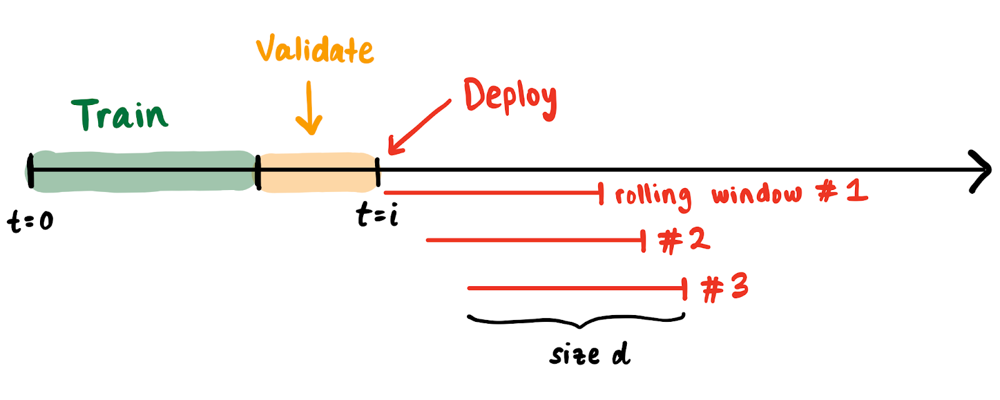

I got interested in MLOps partly because there are [way too many tools](https://huyenchip.com/2020/12/30/mlops-v2.html), and I couldn’t believe that a number of well-respected software veterans and academics were launching new startups left, right, and center. At my previous company, using existing DevOps tools to streamline ML deployment and productionization got me decently far -- but not far enough, motivating me to think about custom solutions to MLOps problems, like ML monitoring.

I like being a PhD student because I can think about problems without anyone yelling at me to build something. The truth is that _I don’t know exactly what to build when it comes to monitoring ML._ The current state of ML monitoring is, without sugarcoating it, a [mess.](https://www.google.com/search?q=ml+monitoring+is+hard&oq=ml+monitoring+is+hard) In this collection of four essays, I illustrate my thoughts on getting to a good open-source ML monitoring solution, with the following outline:

1. Rethinking evaluation for streaming ML (this piece)
2. [WIP] Categorizing the laundry list of post-deployment issues
3. [WIP] Investigating where existing DevOps tools like Prometheus break down in ML monitoring
4. [WIP] Concrete problems in building a general-purpose ML monitoring solution[^1]

## Rethinking evaluation for streaming ML

Before I discuss what to monitor, I’m going to define monitoring as: _tracking metrics to identify when the application is failing._ There are lots of articles out there to convince you that monitoring is necessary for ML applications. Here are my two cents on why we need monitoring:

1. Applications in production will inevitably experience issues. We want to catch and address issues as early as possible to minimize downtime.
2. ML is increasingly being deployed in high-stakes scenarios (e.g., recidivism, loans, credit card fraud, recruiting, autonomous vehicles), where regulation is inevitable.

Many articles also discuss what _types_ of bugs can occur in production ML systems, motivating _what_ to monitor. I personally am overwhelmed with all the bugs that could possibly occur and the [massive](https://twolodzko.github.io/ml-checklist.html) [checklists](https://www.kdnuggets.com/2021/03/machine-learning-model-monitoring-checklist.html) [of](https://deepchecks.com/ml-model-monitoring-checklist-things-you-should-look-out-for/) [tests](https://christophergs.com/machine%20learning/2020/03/14/how-to-monitor-machine-learning-models/) and metrics one must execute and monitor to ensure “good” pipeline health[^2]. At one point in my previous job, I had an existential crisis because **I had no idea why I was monitoring thousands of things; I just assumed it was necessary for pipelines “not to fail.”** But what does it mean to “fail,” especially in the ML context?

### How we got here

The field of machine learning has an interesting history of evaluation. ML-specific metrics have been designed to evaluate how well _a specific model_ performs on _a specific dataset_. To evaluate a model in an "academic" setting, for decades, we’ve measured fixed-point metrics such as accuracy, precision, and recall on a hold-out “validation” set that our model didn’t see during training. To assess whether a model can generalize to new data, introductory machine learning courses stress the importance of checking against _overfitting_ (i.e., the validation set metric should be close to the train set metric). Is this really all we need to claim generalizability?

In today's golden age of benchmarks, we don’t _really_ question this evaluation procedure of computing a metric on some static or fixed dataset (there are [some](http://proceedings.mlr.press/v97/recht19a/recht19a.pdf) [exceptions](https://arxiv.org/abs/2104.14337)). More recently, my friend Deb and other ML leaders have been raising awareness about how [current general-purpose ML evaluation methods fall short in assessing failure modes in ML systems](https://openreview.net/pdf?id=j6NxpQbREA1) related to critical subgroups (e.g., race) and externalities (e.g, energy consumption). I’m mentioning this work because I think it’s incredibly important, albeit orthogonal to what I’m going to talk about here.

We are well-aware that in practice, although [all models are wrong, some are useful](https://www.argmin.net/2021/09/21/models-are-wrong/). ML evaluation in an “industry” setting, unsurprisingly, dates back to military contexts in the 50s and 60s. [ROC curves were invented during World War II to classify enemy objects in battlefields](https://en.wikipedia.org/wiki/Receiver_operating_characteristic), I imagine primarily because practitioners needed to compute useful and discard useless models over time. I like to think of ROC and PR curves as better “aggregations” of metrics, which help inform what threshold of model outputs to act on and how such a threshold changes over time. Such aggregations are clearly necessary when deploying ML in practice (e.g., healthcare) over long periods of time. 

Because **in practice, we work with streams of data, not fixed datasets,** the industry standard for ML monitoring (probably a consequence of software monitoring) follows these steps:

1. Choosing metric(s) and threshold(s) that they believe represent model performance
2. Choose a sliding window size (units are time-based, like days or weeks) to compute metric(s) over
3. Set alerts for when the metric value(s) drop below the threshold(s)
4. Upon alert, manually or [automatically](https://neptune.ai/blog/retraining-model-during-deployment-continuous-training-continuous-testing) [trigger](https://www.phdata.io/blog/when-to-retrain-machine-learning-models/) [a](https://evidentlyai.com/blog/retrain-or-not-retrain) [retrain](https://mlinproduction.com/model-retraining/)

This process assumes that a failure is defined as a metric value dropping below its threshold. Why do we need to get this definition correct? The implications of triggering a retrain when you don’t need to can be bad: it could waste compute, or it might actually _decrease_ performance if the most recent window is not representative of future data. The implications of not triggering a retrain when you need to are, well, your performance will continue to deteriorate -- maybe even silently. Thus, we want our alerts to be sound (i.e., no false alarms) and complete (i.e., triggered every time there is a failure). Unfortunately, I’ve always gotten either too many or too few alerts, motivating me to question -- what’s wrong with our evaluation procedure?

### What’s wrong with our current approach?

I will now argue why **this procedure to evaluate ML on streams of data is broken**. Suppose we have a stream of data points beginning from time t = 0. We train and validate a model on data between t = 0 and t = i. We “deploy” at t = i and continuously compute ML metrics for rolling windows spanning d days. 

There are some natural and common phenomena that get factored into metric computations:

* **Representation differences.** Class ratios across windows may not be the same (e.g., the fraction of positives in one window may be very different from the fraction of positives in another window).
* **Varying sample sizes.** The number of data points in each window may vary (e.g., the number of requests received on a Sunday is less than the number of requests received on a Monday).
* **Delayed feedback.** Due to reasonable events (e.g., loss of Internet connection), labels may come in at a lag, making it impossible to factor in predictions without a label into the current window’s evaluation metric.

In each of these cases, _even if you measure aggregations like auROC and auPRC_, the metric value can change drastically -- without any change in the model’s “alignment” with the desired task (i.e., predictive power) or “concept drift.” When we trigger a retrain, we're implicitly believing that our model doesn't have our expected predictive power. How can we be confident in this belief if our rolling window doesn't match assumptions from our hold-out validation set (e.g., our rolling window spans a week while our validation set spans a month)? Most of the time, we aren't explicitly aware of all the assumptions made at training time. I think **ML-specific metrics evaluated on a rolling window tell you less about model alignment than properties of the data in that window.**

Thus, since we don’t know how to evaluate how aligned the model is with the desired task, evaluation on streams of data varies across different organizations. We don’t know where to draw the line for acceptable business performance, so we look at all the defensible metrics (e.g., auROC) and try to optimize for some aggregation of them. Although we don’t have a better alternative (that I know of), this is clearly broken and renders ML useless in so many product settings. Many industry ML veterans talk about how we need clear and explicit mappings from ML metrics to business outcomes -- mature organizations have a concept of [“SLOs”](https://www.atlassian.com/incident-management/kpis/sla-vs-slo-vs-sli) for ML models, where BizDev and data people collaborate to identify the collection of metrics, window sizes, and alert procedures for a single task (the SLO). When the SLO is not aligned with the task, you have no idea whether a metric drop should trigger a retrain! This collaboration to compute SLO parameters forces people to define how to act on model outputs. Crazily enough, it can take months or even a year to settle on the right parameters to compute the SLO. More importantly and more relevant to my interests -- **such a context-specific procedure for choosing an ML SLO is at odds with building a general-purpose tool to monitor ML pipelines.** 

### Recap

So there are really two distinct problems in streaming ML evaluation I’ve outlined: 

1. It takes time and many resources to make the current “industry-standard” evaluation procedure (choosing metrics, thresholds, and window sizes) work
2. This procedure may never work, depending on the nature of the data, and generalizes very poorly (i.e., it takes the same amount of time and resources to settle on the evaluation protocol or SLOs for a new task) -- _making it really hard to have ML in production_ 

I suspect that an ML-related extension of the [Agile Manifesto](https://agilemanifesto.org/) and better education around the strengths and weaknesses of ML can tackle the first problem. The second problem seems much more unsolved to me -- as an ML infra person, I’m not interested in prescribing specific SLOs; I’m interested in building the infrastructure for anyone to easily monitor the ML SLOs that they care about. 

**I’d love for our ML community to think more deeply about how to generally evaluate the alignment or predictive power of models that will operate over streams of data.** Maybe we can’t do better than the procedure we already have, but I’m curious -- can we build techniques to understand the temporal nature of data _specific to ML outcomes_ and use this information to choose SLOs for us? Can we create more general metrics that explicitly tie to business outcomes, such as an “ML [Apdex Score](https://success.outsystems.com/Documentation/11/Managing_the_Applications_Lifecycle/Monitor_and_Troubleshoot/The_APDEX_Performance_Score)?” Can these general metrics be robust to all three phenomena -- representation differences, varying sample sizes, and delayed feedback -- that I outlined above? I don’t know what this will look like in the end, but I’m fairly confident that being able to articulate and measure the correct SLOs will power a large breakthrough in deriving value from production ML applications. I’m excited for us to make progress.

*Thanks to [Alex Tamkin](https://twitter.com/AlexTamkin), [Rolando Garcia](https://twitter.com/rogarcia_sanz), and [Peter Schafhalter](https://twitter.com/pschafhalter) for feedback on many drafts.*

<!-- Footnotes themselves at the bottom. -->
## Notes

[^1]:

     No MLOps company is paying me to write this. I can’t speak intelligently about solutions hidden beyond paywalls, so I make no claims about existing proprietary tools. Also, I think there is a market for a fully open-source ML monitoring solution. 

[^2]:
     It’s crazy to me that the most useful MLOps resources come from blog posts, Slack channels, and word-of-mouth. The field is totally in its infancy.
