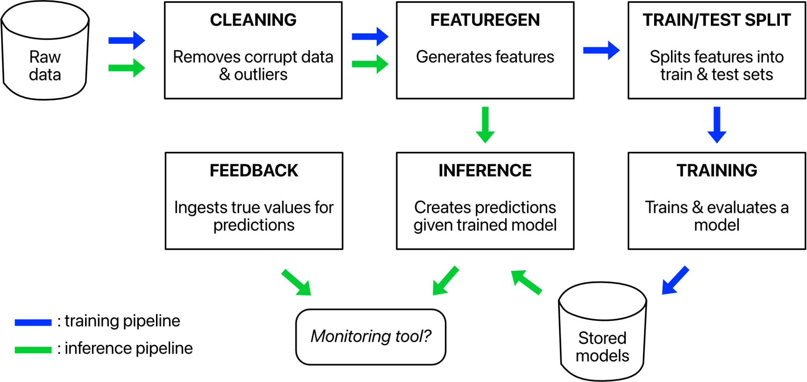
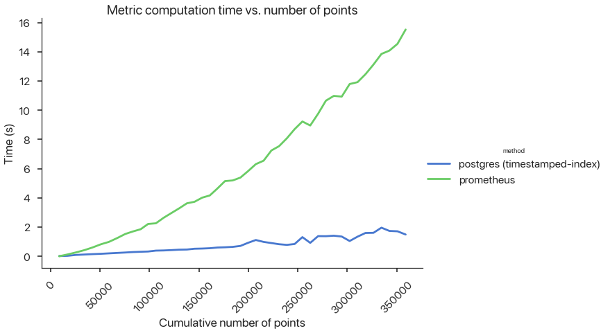

In the [previous essay](https://www.shreya-shankar.com/rethinking-ml-monitoring-2/), I surveyed existing post-deployment issues and categorized them across two axes: state and component. I mentioned that monitoring cross-component stateful metrics, such as model accuracy, is critical for maintaining ML pipelines but difficult with existing tools. In this piece, I demonstrate such difficulties first-hand: we extend a toy ML pipeline with Prometheus (a popular software monitoring tool) to provide ML monitoring. In the process, we’ll see many ways in which Prometheus is inadequate, from code messiness to algorithmic inefficiencies.[^1]

#### Table of Contents
```toc
# This code block gets replaced with the TOC
```


## Background

One day at work, while I was doomscrolling through a Slack channel of AWS alerts, I suddenly realized my infra coworker and I interpreted the term “label” very differently. He meant an identifier. I meant the true value for a prediction. We only figured out that we were misaligned multiple months into a large project. Thankfully, we never collaborated on the same task, so there weren’t any repercussions for us. But I wonder if this misalignment causes a problem in other organizations.

I think the most confusing aspect of the discourse on ML monitoring is the terminology. Terms like “metric” and “label” are overloaded. In this essay, I’ll leverage the following definitions:


* _Metric_: a function that aggregates data to evaluate how well a pipeline is performing (e.g., mean, accuracy)
* _Prometheus Metric_: a time series of numeric measurements
* _Identifier_: a unique name assigned to an object or collection of objects
* _Prediction_: an output made by an ML model
* _Feedback_: the “true” value for a prediction
* _Service Level Indicator (SLI)_: a function that aggregates _predictions and feedback_ to evaluate how well a pipeline is performing (e.g., accuracy)


### ML Task, Data Source, and Pipeline

For this exercise, I constructed an ML pipeline to predict whether a taxi rider will give a driver a high tip (binary classification), using data from the [NYC Taxi Coalition](https://www1.nyc.gov/site/tlc/about/tlc-trip-record-data.page). Using Prometheus, we’ll monitor **cumulative accuracy**, or the accuracy over all the predictions made since deployment. Training and inference pipelines share some components in the architecture, which looks like this:




Since this is a binary classification problem, the inference component generates float-valued predictions between 0 and 1, and the feedback component returns values of either 0 or 1. I host my pipeline and experiment code in [this repository](https://github.com/loglabs/mext) with the following structure:


```markdown
├── README.md
├── components
│   ├── __init__.py
│   └── main.py <!-- defines functions that represent pipeline components, such as clean_data and train_model -->
├── docker-compose.yml <!-- spins up inference, Prometheus, and Grafana containers -->
├── inference
│   ├── Dockerfile
│   └── main.py <!-- chains functions from components into an inference pipeline and benchmarks usage of mext/prometheus_ml_ext.py -->
├── model.joblib
├── monitoring
│   ├── config.monitoring <!-- Grafana credentials -->
│   ├── datasource.yml <!-- Grafana config -->
│   └── prometheus.yml <!-- Prometheus config, includes scrape interval -->
├── mext
│   ├── __init__.py
│   └── prometheus_ml_ext.py <!--  creates 2 Prometheus Gauge Metrics, one for predictions and another for feedback -->
├── setup.py
└── train.py
```


I run the training pipeline on data from January 2020 and simulate a deployment starting February 1, 2020. **I don’t perform any retraining**, mainly because the **purpose of this exercise is to demonstrate Prometheus’s failure modes, not debug low SLIs that result from “[data drift](https://docs.microsoft.com/en-us/azure/machine-learning/how-to-monitor-datasets?tabs=python#what-is-data-drift).”**


## Prometheus Primer

[Prometheus](https://prometheus.io/docs) is an open-source software monitoring tool that:


1. Collects and stores Metrics[^2], like response latency


2. Allows users to query aggregations of Metric values (e.g., mean latency) via a query language called PromQL

Prometheus supports [four types](https://prometheus.io/docs/concepts/metric_types/) of Metric values:


* **Counter**: a cumulative Metric that monotonically increases. Can be used to track the number of predictions served, for example.
* **Gauge**: a Metric that represents a single numerical value that can arbitrarily change. Can be used to track current memory usage, for example.
* **Histogram**: a Metric that categorizes observed numerical values into user-predefined buckets. This has a high server-side cost because the server calculates quantiles at query time. 
* **Summary**: a Metric that tracks a user-predefined quantile over a sliding time window. This has a lower server-side cost because quantiles are configured and tracked at logging time. Also, the Summary Metric doesn’t generally support aggregations in queries.

Typically, DevOps or SRE folks at organizations use Prometheus to monitor software SLOs. Users instrument their application code to log Metric values. Those values are scraped and stored in a Prometheus server. The values can be queried using PromQL and exported to a visualization tool like Grafana. The architecture looks like this:


[This educational series of posts](https://iximiuz.com/en/series/learning-prometheus-and-promql/) by Ivan Velichko explains Prometheus well. I’ll summarize some of his key points:


* Prometheus is not a time series database (TSDB). It merely leverages a TSDB. 
* Because Prometheus scrapes values periodically, some Metric types (e.g., Gauges) can lose precision if the Metric value changes more frequently than the scraping interval. This problem does not apply to monotonically increasing metrics (e.g., Counters).
* Metrics can be logged with arbitrary identifiers such that at query time, users can filter Metrics by their identifier value.
* PromQL is flexible – users can compute [many different aggregations](https://prometheus.io/docs/prometheus/latest/querying/functions/) of Metric values over different window sizes, and these parameters can be specified at query time. 

Velichko acknowledges that PromQL is [“far from trivial”](https://iximiuz.com/en/posts/prometheus-vector-matching/) (i.e., annoying) to use in real software applications. However, after learning vector matching and other syntax, I don’t think it’s too bad – especially when we don’t need to join Metrics. PromQL queries usually aren’t too long, and there are a number of [helper functions](https://prometheus.io/docs/prometheus/latest/querying/functions/) to use while querying. But we’ll see how bad it is for the ML monitoring case. 


## Prometheus 🤝 ML

The following questions will help assess whether Prometheus is a suitable ML monitoring solution:


1. Can we use Prometheus Metrics to track any ML metrics we want in our ML pipeline? It’s not straightforward to map “ML metrics” to the Prometheus Metric types. For single-component stateful metrics, maybe we want to use a histogram or summary metric. If we’re interested in cross-component stateful metrics, we need to consider how we “join” the metrics from different components tgogether to compute ML SLIs like accuracy and precision. 
2. How hard is it to write ML SLIs in PromQL?
3. What’s the query latency for ML SLIs?


### Pipeline Instrumentation


#### Cross-component stateful metrics

None of the Prometheus Metric types (Counter, Gauge, Histogram, or Summary) obviously map to the SLI we want to measure: cumulative accuracy. Instead, we will use 2 Gauge Metrics[^3] – one for pipeline predictions and one for feedback – and aggregate them in PromQL to compute accuracy. In `mext/prometheus_ml_ext.py`, I define a <code>[BinaryClassificationMetric](https://github.com/loglabs/mext/blob/4db79bd2975822c7a82aebd73537fe219edff5d1/mext/prometheus_ml_ext.py#L83)</code> class that contains the Gauge Metrics along with <code>logOutputs</code> and <code>logFeedbacks</code> methods to update them after each inference invocation. Instrumenting the application is quite straightforward. Here is the Prometheus-specific code in <code>inference/main.py</code>:


```python
prom_metric = BinaryClassificationMetric(
  "taxi_data", "Binary classification metric for tip prediction", ["output_id"],
)

def run_predictions():
  # Run inference pipeline
  …
  predictions, _ = inference(...)

  # Log predictions and feedbacks
  outputs = predictions["prediction"].to_list()
  feedbacks = predictions["high_tip_indicator"].astype("int").to_list()
  identifiers = predictions["identifier"].to_list()
  prom_metric.logOutputs(outputs, identifiers)
  prom_metric.logFeedbacks(feedbacks, identifiers)
```


Representing the cumulative accuracy as two Gauge Metrics wasn’t exactly straightforward, but I’ll still rate this experience as easy.


#### Single-component stateful metrics

ML monitoring solutions frequently monitor aggregations of inputs and outputs, such as median and p90, to crudely measure “data drift.” Sometimes, they also compute more complicated statistical tests (e.g., Kolmogorov-Smirnov test), which I definitely will never be able to write in PromQL. These methods are neither sound nor complete, but for the purpose of this exercise, we can keep track of various percentiles of output values using a Histogram Metric.  Here’s the relevant instrumentation code in `inference/main.py`:


```python
hist = Histogram("model_output", "Some description here", buckets =list( np.arange(0, 1.01, 0.1)) + float("inf"))

def run_predictions():
  # Run inference pipeline
  …
  predictions, _ = inference(...)

  # Log predictions and feedbacks
  outputs = predictions["prediction"].to_list()
  for output in outputs:
    hist.observe(output)
```


This integration is easier than the cross-component case, but **a major drawback is that we need to define our histogram buckets up front.** This is bad for two reasons: (1) we often don’t know what the distribution of outputs looks like ahead of time, and (2) the distribution may change as the data “drifts.”


### PromQL for ML SLIs

Now that we’ve instrumented our pipeline, we can spin up our containers via Docker-Compose to begin scraping logged Metric values and extract our ML metrics using PromQL. Using PromQL constructs and a very large whiteboard, I came up with the following queries:[^4]


<table>
  <tr>
   <td><strong>ML Metric</strong>
   </td>
   <td><strong>PromQL Query</strong>
   </td>
  </tr>
  <tr>
   <td>Accuracy
   </td>
   <td><code>count(abs(binary_class_metric_test_label - on (output_id) binary_class_metric_test_prediction) &lt; 0.5) / count(binary_class_metric_test_label - on (output_id) binary_class_metric_test_prediction)</code>
   </td>
  </tr>
  <tr>
   <td>Precision
   </td>
   <td><code>count( (binary_class_metric_test_label * on (output_id) binary_class_metric_test_prediction) > 0.5) / count((binary_class_metric_test_prediction and on (output_id) binary_class_metric_test_label) > 0.5)</code>
   </td>
  </tr>
  <tr>
   <td>Recall
   </td>
   <td><code>count( (binary_class_metric_test_label * on (output_id) binary_class_metric_test_prediction) > 0.5) / count((binary_class_metric_test_label and on (output_id) binary_class_metric_test_prediction) == 1)</code>
   </td>
  </tr>
  <tr>
   <td>Average output [5m]
   </td>
   <td><code>sum(rate(model_output_sum[5m])) / sum(rate(model_output_count[5m]))</code>
   </td>
  </tr>
  <tr>
   <td>Median output [5m]
   </td>
   <td><code>histogram_quantile(0.5, sum by (le) (rate(model_output_bucket[5m])))</code>
   </td>
  </tr>
  <tr>
   <td>Probability distribution of outputs [5m]
   </td>
   <td><code>sum(rate(model_output_bucket[5m])) by (le)</code>
   </td>
  </tr>
</table>


There are several issues with using PromQL for ML SLIs:

**Incorrectness.** When I first ran the query for accuracy, I was surprised that the results weren’t fully accurate (ha-ha). This was because my scrape interval was 15 seconds, which was too large for the rate at which I was producing new predictions. Shortening the scrape interval to 5 seconds improved the precision of the query but made the Prometheus container slower and consume more memory and compute resources.

**Sliding window challenges.** Even after several hours, I could not figure out how to compute any of the first 3 metrics (cross-component) over fixed window sizes. I found no resources on computing joins in PromQL over sliding windows. I’m not super competent at using Prometheus, so please let me know if it’s possible to compute such metrics over windows.** **

**Disgusting queries.** The last 3 metrics (single-component) in the table aren’t as convoluted as the first 3 (cross-component). I would not expect _any_ data scientist to write these cross-component PromQL queries, especially for functions that are simply one call to a scikit-learn module. _An ideal monitoring tool should allow users to pass in custom Python functions as metrics and efficiently produce values for these metrics over time in the backend._


### Query Latency

In this subsection, I focus on latency, specifically for cross-component queries. To compute an SLI like accuracy, as shown in the previous subsection, we need to do a join on `output_id`. This is an *egregious* abuse of Prometheus, as the `output_id` cardinality obviously grows with the number of predictions an ML pipeline makes. **Prometheus isn’t meant to handle high-cardinality identifiers, let alone high-cardinality joins.**

To demonstrate how poorly Prometheus scales, I prototyped a small Postgres backend that houses predictions and feedbacks in timestamp-indexed tables. I computed accuracies in both PromQL and PostgreSQL and measured latency with respect to number of predictions generated by the pipeline:





Since Prometheus Metric values are not computed eagerly (i.e., they are all computed when a user wants to query or plot them on Grafana over a period of time), **this latency is unacceptable and doesn’t scale**. As more predictions are generated, many organizations that want to keep track of a real-time ML SLI might not be able to update or refresh their SLIs quickly enough. Maybe in some domains, computing SLIs daily or even hourly might be enough, but it won’t work for domains where data and user preferences change frequently.  I know I’m using Prometheus for a situation where it’s not designed for, but all in all, these issues collectively highlight the need for organizations to either (1) have an ML monitoring team that creates a layer on top of Postgres or an existing DBMS, or (2) leverage a proprietary vendor specific for ML monitoring. I’m convinced, now, that **we need better ML monitoring practices and tools.**


## Recap

In this post, I highlighted some of the major pitfalls of using Prometheus for ML monitoring, most notably:


* Needing to use multiple Prometheus Metric types for cross-component monitoring
* Needing to define histogram buckets up front for single-component monitoring
* Correctness of query results depending on scraping interval
* Inability to handle sliding windows[^5]


* Disgusting-looking PromQL queries
* High latency for cross-component metrics (i.e., high-cardinality joins)

In the next and final piece in this series, I’ll discuss some key requirements and ideas for building a general-purpose ML monitoring tool. I’m super excited to share it with you all, along with a prototype[^6] for monitoring real-time ML SLIs. More to come, and happy new year!

*Thanks to [Divyahans Gupta](https://twitter.com/divyahansg), [Preetum Nakkiran](https://twitter.com/PreetumNakkiran), and [Peter Schafhalter](https://twitter.com/pschafhalter) for feedback on many drafts.*


<!-- Footnotes themselves at the bottom. -->
## Notes

[^1]:
     This post is geared towards ML engineers and infra people. I recommend having a basic awareness of databases _(e.g., tables, joins, indexes), ML SLIs (e.g., accuracy, precision, recall), and query languages (e.g., SQL, PromQL)._

[^2]:

      I capitalize Metric to refer to the Prometheus Metric abstraction.

[^3]:
     I choose Gauge Metrics for predictions and feedback because they represent numerical values that can go up or down. Since feedback and inference components are usually separated from each other in ML pipelines, there really isn’t a way (that I can think of) to avoid a join.

[^4]:
     I wouldn’t be surprised if these queries were wrong. Please correct me if there’s an error.

[^5]:

     Maybe this is not a failure mode – I just couldn’t figure it out. Please let me know if I’m wrong!

[^6]:
     Built on `mltrace`, of course. I can’t wait for it to be production-ready! I’m guessing it’ll be around Q2 or Q3 this year.
