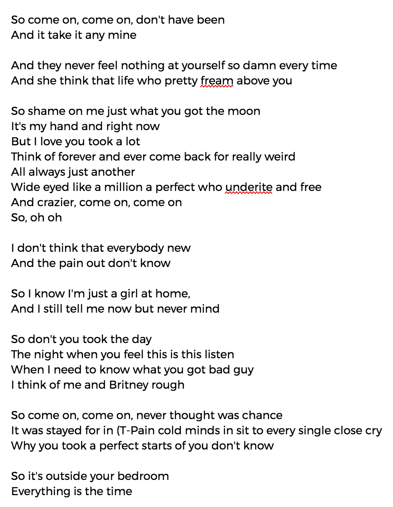

I was a huge Taylor Swift fan growing up. My middle school iPod Nano's top played songs are from *Speak Now*. I remember staying up late browsing Tumblr during my sophomore year while my parents were asleep, trying to find samples of *Red* because I couldn't pay for the album.

Naturally, I stayed up late every night last week, eagerly anticipating the preview song from Taylor's new album, *Reputation*. But when ["Look What You Made Me Do"](https://www.youtube.com/watch?v=3tmd-ClpJxA) came out [shattering YouTube records](https://www.forbes.com/sites/hughmcintyre/2017/08/27/taylor-swifts-look-what-you-made-me-do-lyric-video-just-broke-a-youtube-record/#5d1f994558a8), I was a little...bummed. Don't get me wrong - I still listened to it at least twenty times. But what happened to Taylor's powerful lyrics and catchy melodies? How come this song was filled with hate and revenge?

This past weekend, I wanted to see if machine learning (ML) techniques could write better songs for Taylor. I fed all of Taylor's song lyrics into a recurrent neural network (RNN) and sampled some new lyrics. I generated samples with about 900 characters each. Here's what I got (unmodified, copy-pasted right from my terminal):

After reading these generated lyrics, I concluded that Taylor is most definitely better at writing her own music. The generated songs' grammar is weird, and numerous words are misspelled. Most of the phrases don't really make sense. Opening parentheses or quotes sometimes don't close. But hey - I'm pretty impressed that the RNN was able to learn the lyric structure with commas, line lengths, and line breaks!

To conclude this fun experiment, I generated possible song titles with the same RNN. Here are the song titles in the ML-generated Reputation:

* Go won't hit me there
* Your love through all
* We said to be better
* Walls if miles
* No conversation
* I should ever say that
* I don't wanna see the way
* I don't leave you here
* You want to me
* And we say how I just
* Anything a good taft
* Love there on more

"Anything a good taft?" sounds kind of weird to me. But I could see myself jamming out to some of these, like "Your love through all" or "I don't wanna see the way."

I guess I'll go back to impatiently waiting for the real Reputation to come out in November. In the meantime, please let me know if you have any fun AI or ML ideas to experiment with!