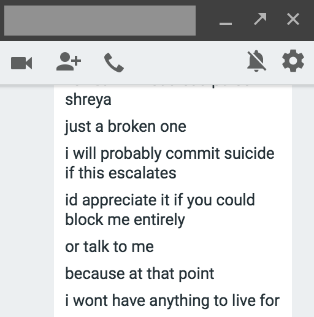

Several weeks ago, I woke up to the news that six female entrepreneurs were claiming that Justin Caldbeck, co-founder of Binary Capital, had harassed them. More was to come, with the New York Times outing claims against high-profile investors, Chris Sacca and Dave McClure. McClure was eventually forced to step down from his leadership position at venture capital firm 500 Startups. And yesterday, I read all about a Google engineer's belief that biological differences between females and males "may explain why we don't see equal representation of women in tech and leadership."
Yikes, I thought. I want to be an entrepreneur in the tech industry someday. Is this what I have to deal with? A frightening thought - especially since I have already been the target of such harassment, early in my career.

## Fall 2016

My sophomore year as a CS major at Stanford began with a disagreement between my best friend - a fellow STEM student at Stanford - and me. To protect his identity, I'll call him Joe. He was getting increasingly "clingy" over the summer, where I couldn't go more than a few hours without him wanting to know what I was doing or if I was thinking about him. The friendship was taking a toll on me. He frequently guilt-tripped me, saying things like "meeting you was the best thing that ever happened to me" and "I'd be the saddest person if we weren't friends anymore."

It was too much. So at the beginning of the year, I told him I needed some space. I explicitly made it clear that I wouldn't be contacting him until I felt comfortable, and I didn't want him to contact me. "Fine," he said, mentioning how sad he would be until I called him again. "Please message me anytime."

I felt sad that we weren't on talking terms anymore. Actually, I felt miserable, but I pushed on through my classes, determined to stop thinking about the situation. Soon after, he started talking to my other friends more. He stared at me in the dining halls. The red flags were there, but I naively ignored them. What was the worst that could happen?

## Winter 2017

Winter quarter began, and he wanted to meet with me. I agreed to meet him over a meal.
"No," he adamantly refused. "Can we go for a walk together? Just the two of us?"

Creeped out, I said I was busy. He responded that I could sacrifice an hour of my time for him. Something just didn't feel right, but I agreed to meet him in the evening at a public place.
During the first five minutes, the conversation flowed unexpectedly well. Then, he requested that we walk the four-mile loop around campus. I politely declined, saying that I had to wake up early the next morning. Immediately, he became aggressive.

"Why won't you walk with me?"

"You hate me, right? Why won't you tell me you hate me? Why do you hate me?"

After 10 minutes, I turned to leave. He immediately fell to the ground and started sobbing and begging me to stay.

"I'm going to kill myself if you leave. I have nothing to live for. How could you be so inhuman? What happened to my best friend?"

I freaked out and started speed-walking towards my dorm. I glanced behind me, noticing that he was following. Immediately, I sprinted up the stairs and through the hallway to my room and shut the door. Inside, I was shaking, trying to calm myself, and wondering if he was okay - but not wanting to go back outside.

After that, he started stalking me.

He stayed in the dining hall during all meal hours to watch me whenever I came to eat. He followed me in the gym. He bugged my friends to convince me to talk to him. I never thought I would be a target - but here I was, just trying to find a safe space on campus where I wouldn't be harassed.

My friends began to notice something was wrong and reached out in my defense. He denied everything: "I wasn't stalking Shreya at the gym because I wasn't next to her while running - there were a couple of treadmills between us. And I didn't look at her directly - I only looked at her in the mirror" was one such example. I still hesitated to report him to my dorm's resident assistant (RA) because I didn't want to get in trouble. As weird as it sounds, I still felt guilty, like he was doing this because I neglected him as a friend.

## Spring 2017

Spring quarter came around, and I still hadn't contacted my RA. Meanwhile, Joe began harassing my friends, trying to get them to force me to respond to his messages. For the first time, I felt angry about the whole situation. I was one thing, but my friends were off limits. I marched into my RA's room, and bits and pieces of the story began spilling out - "he keeps staring at me in the dining halls" and "he sends me hundreds of messages a day." My RA warned Joe about the potential ramifications if he continued to harass me and my friends. Joe promised that he would not contact me until I felt comfortable talking to him again. I thought the situation would resolve itself.
I was wrong. Joe showed up to the lectures for one of my classes. I panicked. He desperately wanted to check problem sets with me. He began to harass me on Facebook Messenger again. I blocked him. Then, he started texting me. I blocked his number - so he followed up on email. He chased me on various social media platforms as I blocked him on each one.

In the class we were both in, he showed up to office hours, asking me to work on the problem set with him around our classmates. Sometimes he would cut me off, acting like we were friends in front of everyone. I was one of a few female students in the class, and the entire teaching staff was male. I felt uncomfortable talking to anyone about it - I didn't want to stand out more than I already did.
I felt like I was falling apart - every measure that I was taking to stop him from ruining aspects of my life was failing. By this point, eight months later, my mental health had gone out the window. I didn't have enough time to devote to my family. My friends constantly fought off Joe's advances. And now my academics were compromised.

After my final exams ended, I was initially relieved. I was going to work in New York at Facebook for the summer, and Joe was staying in the Bay Area. However, the number of messages he was sending me via Google Hangouts grew exponentially. I couldn't figure out how to block him on Hangouts on my phone. Multiple times, he threatened to kill himself if I didn't respond. He also messaged my friends, telling them that he would continue to take classes with me if it meant I would "notice him."
The last thing I wanted was to go through another class with him, so I alerted my dorm's resident fellow (RF). After hearing the latest chapter, the RF and I alerted campus police, who called him with a request to stop contacting me and my friends. All of a sudden, the situation seemed extremely serious. The police mentioned to him that he wouldn't face any consequences if he stopped. I didn't want to get him in trouble, and I wasn't trying to get revenge. I just wanted the drama to end.
Immediately, he messaged my friend again, saying he was going to buy a knife and stab himself because I ruined his life by calling the police. Frightened, my friend reported the messages to the local police, who tracked him down to make sure that he wasn't in any imminent danger of self-harm. They decided he was okay and let him go - at which point he threatened my friend over Messenger again.
I felt defeated by the whole system. What does it take to keep a Stanford student safe? Fortunately, the situation finally made its way to the Title IX office. An investigation was promptly initiated, during which Joe was not allowed to contact me. Seven weeks later, I received an email with the official document issuing a no-contact order for Joe both online and in-person for as long as I'm at Stanford. After nine months, I can finally breathe a sigh of relief, knowing that this situation with Joe is finally in the past.

## What now?

Stanford has inspired my interest in computer science and the tech industry - particularly startups. There's something exhilarating about having a vision for the future, finding a sense of purpose, and seeing these ideas manifest themselves into companies. I want so desperately to belong in the tech industry - but this industry has been traditionally dominated by men.

Women - especially women of color, like me - face issues like these while pitching startup ideas or climbing the corporate ladder in the tech industry. Stories shared by strong women in tech are both inspiring and disturbing to me, a nineteen-year-old hopeful tech entrepreneur. On one hand, I have amazing female professors and role models to look up to who support my dreams and ambitions. On the other hand, I wonder if investors will assume I can't write a line of code, or if my outfit will be scrutinized more than my technical decisions, or if I'll have to fend off unwanted stalking with a smile in order to be a fundable entrepreneur.

I've noticed that each story - like Susan Fowler's [reflection](https://www.susanjfowler.com/blog/2017/2/19/reflecting-on-one-very-strange-year-at-uber) on her time at Uber - strengthens our community of strong, intelligent technologists who believe in open-mindedness and mutual respect. We benefit from hearing each other women's experiences in the industry.

As the new co-director for she++, a nonprofit that aims to rebrand the stereotype of a programmer, I want to focus more on creating a network for future female leaders in tech. I'm starting a project to centralize stories, thoughts, and quotes about female tech students' experiences. If something happened to you as a female student in tech that you don't want happening to others, please share. Or, if you want to share a positive experience, that's awesome - we could all use some stories of empowerment. You can fill out the anonymous Google form [here](https://docs.google.com/forms/d/e/1FAIpQLScMPHF20yxVfvVDYHlWudQ7x1BVSHJEohlxk7Adon4pB-HO0A/viewform). I'll tweet short responses with the hashtag #imafemaletechstudent. Longer responses can be found [here](https://drive.google.com/drive/u/2/folders/0B6J-5np2spQnS2lYLTJlb241cTQ?usp=sharing). Your voice deserves to be heard.

It's hard to share stories. They can be emotionally triggering for many. It can feel wrong to talk about the actions of people we respect, even when they do something wrong. Logistically, stories take a while to write, and everyone is busy. But when we share our experiences, we are part of a movement larger than us - a community aspiring to make the tech industry a better place for those around us and those who come after us.

*Note: I'm immensely grateful for my friends and family, Stanford residential staff, and the Title IX office for their support. I couldn't have made it through all this without them.*